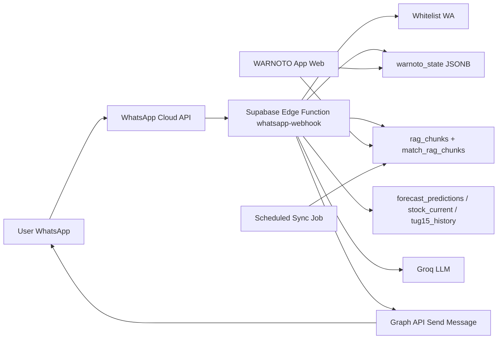

# Spesifikasi Fitur WA AI Agent WARNOTO

Dokumen ini adalah spesifikasi mandiri untuk integrasi **AI Agent WARNOTO ke WhatsApp**. Tujuannya agar alur, batasan keamanan, kebutuhan Supabase, webhook, dan instruksi migrasi ke Claude dapat dipahami tanpa harus membaca seluruh `WARNOTO_DOCS.md`.

Status dokumen: planning final-ish untuk implementasi v1.

---

## 1. Latar Belakang

WARNOTO sudah memiliki AI Agent di aplikasi web untuk membantu user bertanya tentang stok, forecast, transaksi TUG, rencana kedatangan, dan kondisi gudang. Saat ini AI Agent web membaca data langsung dari state aplikasi/browser dan knowledge base RAG yang disinkron ke Supabase.

Fitur baru ini bertujuan membuat AI Agent dapat diakses langsung dari WhatsApp, sehingga user manajemen/operasional bisa bertanya tanpa membuka aplikasi web.

Prinsip utama v1:

- WhatsApp hanya menjadi kanal tanya-jawab.
- Tidak ada aksi tulis lewat WhatsApp.
- Jawaban harus berbasis data WARNOTO, bukan asumsi bebas.
- Nomor pengirim harus masuk whitelist.
- Semua percakapan penting dicatat untuk audit.

---

## 2. Scope v1

Masuk scope:

- Integrasi WhatsApp Cloud API via Supabase Edge Function.
- Webhook `GET` untuk verifikasi Meta.
- Webhook `POST` untuk menerima pesan WhatsApp.
- Validasi nomor pengirim berdasarkan whitelist.
- Jawaban AI read-only berbasis data WARNOTO.
- Command dasar:
  - `help`
  - `menu`
  - `status sinkron`
- Audit metadata + ringkasan.
- Sync data WARNOTO ke Supabase agar AI Agent WA bisa membaca konteks yang setara dengan AI Agent web.
- Sync RAG/knowledge base otomatis harian.

Di luar scope v1:

- Approve/reject TUG lewat WhatsApp.
- Membuat TUG lewat WhatsApp.
- Mengubah stok, lokasi, katalog, minQty, atau data master.
- Apply rekomendasi Material Cadang lewat WhatsApp.
- Login penuh lewat WhatsApp.
- WhatsApp Web gateway non-resmi.
- Voice note, gambar, dokumen, atau OCR lewat WhatsApp.

---

## 3. Posisi Terhadap Sistem Saat Ini

File existing yang relevan:

- `App.jsx`
  - AI Agent web sudah ada.
  - Fungsi chat web memakai Groq dan optional RAG Cohere/Supabase.
  - Data live masih banyak berada di React state/storage browser.
- `supabase/functions/whatsapp-webhook/index.ts`
  - Skeleton webhook WhatsApp Cloud API sudah ada.
  - Saat ini cakupannya masih terbatas ke RAG/Supabase, belum setara AI Agent web.
- `supabase/schema.sql`
  - Sudah ada tabel `katalog`, `stock_current`, `tug15_history`, `forecast_predictions`, `profiles`, dan `rag_chunks`.
  - Sudah ada fungsi `match_rag_chunks`.

Konsekuensi desain:

- Edge Function tidak bisa membaca localStorage/browser state.
- Agar WA Agent setara AI Agent app, data WARNOTO harus tersedia server-side.
- Untuk v1, server-side state boleh memakai JSONB per domain sebelum dilakukan normalisasi tabel penuh.

---

## 4. Arsitektur Target



Komponen:

- **WhatsApp Cloud API**
  - Kanal resmi dari Meta.
  - Mengirim event pesan masuk ke webhook.
- **Supabase Edge Function**
  - Endpoint publik yang menerima webhook.
  - Memvalidasi token Meta saat setup.
  - Memvalidasi nomor pengirim.
  - Membaca data server-side.
  - Memanggil AI.
  - Mengirim balasan.
- **Supabase State**
  - Menyimpan snapshot state WARNOTO yang dibutuhkan AI Agent WA.
- **RAG**
  - Menyediakan pencarian semantik untuk katalog/transaksi.
- **Audit Log**
  - Menyimpan metadata percakapan dan status proses.

---

## 5. Behavior WhatsApp

### 5.1 Pesan yang Didukung

V1 hanya menerima pesan teks.

Jika user mengirim gambar/audio/dokumen/stiker:

```text
Saat ini WA Agent WARNOTO hanya menerima pertanyaan teks. Silakan ketik pertanyaan tentang stok, material, forecast, TUG, atau rencana kedatangan.
```

### 5.2 Nomor Tidak Terdaftar

Jika nomor pengirim tidak ada di whitelist atau statusnya tidak aktif:

```text
Maaf, nomor ini belum terdaftar untuk mengakses WA Agent WARNOTO. Hubungi Admin WARNOTO untuk aktivasi.
```

Jangan ungkap data sistem kepada nomor yang tidak terdaftar.

### 5.3 Command `help` / `menu`

Balasan:

```text
WA Agent WARNOTO siap membantu.

Contoh pertanyaan:
1. Material apa yang stoknya kritis?
2. Berapa saldo material cadang saat ini?
3. TUG apa saja yang masih pending?
4. Apa rencana kedatangan 30 hari ke depan?
5. Forecast material yang akan habis?

Ketik "status sinkron" untuk melihat waktu update data terakhir.
```

### 5.4 Command `status sinkron`

Balasan minimal:

```text
Status sinkron WARNOTO:
- Snapshot data: [tanggal/jam]
- Knowledge Base/RAG: [tanggal/jam]
- Status terakhir: [OK / ERROR]

Jika data terlalu lama, silakan minta Admin menjalankan sync atau cek aplikasi WARNOTO.
```

### 5.5 Pertanyaan Bebas

Pertanyaan bebas diteruskan ke AI dengan konteks:

- snapshot state WARNOTO;
- hasil RAG relevan;
- data cepat dari `stock_current`;
- data forecast dari `forecast_predictions`;
- status freshness data.

Jawaban harus ringkas dan cocok untuk WA:

- jangan membuat tabel panjang;
- gunakan poin pendek;
- cantumkan tanggal sumber data;
- jika data tidak tersedia, katakan tidak tersedia;
- jangan mengarang angka.

---

## 6. Batasan Read-Only

WA Agent v1 tidak boleh menjalankan aksi mutasi:

- Tidak boleh membuat/mengubah/menghapus TUG.
- Tidak boleh approve/reject transaksi.
- Tidak boleh mengubah stok.
- Tidak boleh mengubah Master Katalog.
- Tidak boleh mengubah lokasi/blok.
- Tidak boleh mengubah `minQty`.
- Tidak boleh apply rekomendasi Material Cadang.

Jika user meminta aksi tulis:

```text
Untuk keamanan audit, WA Agent WARNOTO v1 hanya bisa memberi informasi. Aksi seperti approval, perubahan stok, atau perubahan master data tetap harus dilakukan melalui aplikasi WARNOTO.
```

---

## 7. Akses dan Whitelist

Keputusan v1:

- Akses memakai whitelist nomor WhatsApp.
- Semua nomor whitelist mendapat akses read-only yang sama.
- Tidak ada pembatasan jawaban berdasarkan role.
- Role tetap boleh disimpan untuk audit, tetapi tidak dipakai untuk filtering v1.

Normalisasi nomor:

- Simpan nomor dalam format internasional tanpa `+`.
- Contoh: `6281234567890`.
- Saat menerima event dari Meta, field `message.from` sudah dalam format internasional tanpa `+`.

Struktur whitelist disarankan:

```sql
create table if not exists wa_allowed_users (
  id bigint generated always as identity primary key,
  phone_number text unique not null,
  display_name text not null,
  warnoto_user_id uuid references profiles(id) on delete set null,
  role text,
  is_active boolean not null default true,
  notes text,
  created_at timestamptz default now(),
  updated_at timestamptz default now()
);
```

Alternatif:

- Tambahkan kolom `wa_phone_number` dan `wa_enabled` pada `profiles`.
- Untuk v1, tabel khusus `wa_allowed_users` lebih aman karena tidak mengganggu skema profil existing.

---

## 8. Server-Side State WARNOTO

### 8.1 Alasan

AI Agent web saat ini bisa membaca state aplikasi langsung dari browser. Supabase Edge Function tidak bisa membaca state tersebut. Karena itu perlu snapshot state di Supabase.

### 8.2 Struktur Minimum

Gunakan tabel key-value JSONB:

```sql
create table if not exists warnoto_state (
  key text primary key,
  data jsonb not null,
  updated_at timestamptz default now(),
  updated_by uuid references profiles(id) on delete set null
);
```

Key awal:

```text
stocks
katalogList
txns
rencanaKedatanganList
lokasiList
approvalHistoryList
opnameList
stockCountList
materialCadangAnalysis
```

Catatan:

- `materialCadangAnalysis` disiapkan untuk fitur Material Cadang nanti.
- Jika suatu domain belum ada, WA Agent harus tetap berjalan dengan warning data terbatas.
- JSONB ini bukan pengganti normalisasi jangka panjang, tetapi cukup untuk menyamakan konteks AI Agent web dan WA Agent.

### 8.3 Sync dari App

Saat `saveToCloud()` atau event sync khusus Admin berjalan, app menyimpan state domain utama ke `warnoto_state`.

Strategi v1:

- Sync snapshot saat Admin/TL membuka aplikasi dan data berhasil load.
- Sync ulang setelah perubahan besar yang sudah existing memanggil `saveToCloud`.
- Simpan `updated_at` per key.
- Jika Supabase tidak terkonfigurasi, app tetap jalan seperti sekarang.

---

## 9. RAG dan Sync Harian

RAG existing:

- Tabel: `rag_chunks`.
- RPC: `match_rag_chunks`.
- Embedding: Cohere `embed-multilingual-v3.0`.
- Dimensi vector: 1024.

Target baru:

- RAG tidak hanya manual dari tombol Admin.
- Ada sync otomatis harian.
- WA Agent memeriksa freshness RAG sebelum menjawab.

Tabel status:

```sql
create table if not exists wa_sync_status (
  key text primary key,
  last_success_at timestamptz,
  last_attempt_at timestamptz,
  status text not null default 'NEVER_RUN',
  error_message text,
  metadata jsonb default '{}'::jsonb
);
```

Key awal:

```text
warnoto_state_snapshot
rag_daily_sync
whatsapp_webhook
```

Aturan freshness:

- Jika snapshot atau RAG lebih lama dari 24 jam, jawaban tetap boleh dikirim.
- Tambahkan warning pendek:

```text
Catatan: data terakhir tersinkron lebih dari 24 jam lalu, mohon verifikasi di aplikasi WARNOTO untuk keputusan final.
```

---

## 10. Audit Log WA

Audit v1 menyimpan metadata + ringkasan, bukan seluruh jawaban panjang.

Struktur:

```sql
create table if not exists wa_agent_logs (
  id bigint generated always as identity primary key,
  phone_number text not null,
  allowed_user_id bigint references wa_allowed_users(id) on delete set null,
  message_id text,
  question text,
  intent text,
  response_summary text,
  status text not null,
  error_message text,
  model text,
  rag_match_count integer,
  created_at timestamptz default now()
);
create index if not exists idx_wa_agent_logs_phone_created on wa_agent_logs(phone_number, created_at desc);
```

Status:

```text
RECEIVED
REJECTED_NOT_WHITELISTED
IGNORED_NON_TEXT
ANSWERED
ERROR_AI
ERROR_SEND_WA
```

Catatan keamanan:

- Jangan simpan secrets/API key.
- Jangan simpan raw request lengkap dari Meta kecuali untuk debug sementara.
- Jika menyimpan `question`, anggap sebagai data internal.

---

## 11. Edge Function Flow

### 11.1 GET Verification

Input Meta:

- `hub.mode`
- `hub.verify_token`
- `hub.challenge`

Flow:

1. Cek `hub.mode === "subscribe"`.
2. Cek token sama dengan `WHATSAPP_VERIFY_TOKEN`.
3. Jika cocok, return `hub.challenge` status 200.
4. Jika tidak cocok, return 403.

### 11.2 POST Message

Flow:

1. Parse body.
2. Ambil `message`.
3. Jika event bukan pesan baru, return 200.
4. Jika pesan bukan teks:
   - log `IGNORED_NON_TEXT`;
   - kirim balasan non-teks tidak didukung;
   - return 200.
5. Normalisasi `fromNumber`.
6. Cek whitelist.
7. Jika tidak aktif/terdaftar:
   - log `REJECTED_NOT_WHITELISTED`;
   - kirim balasan penolakan;
   - return 200.
8. Deteksi command:
   - `help` / `menu`;
   - `status sinkron`;
   - request mutasi;
   - pertanyaan bebas.
9. Untuk pertanyaan bebas:
   - baca `warnoto_state`;
   - baca `wa_sync_status`;
   - jalankan RAG;
   - baca tabel cepat jika relevan;
   - panggil Groq.
10. Kirim balasan ke Graph API.
11. Simpan audit log.
12. Selalu return 200 ke Meta setelah request diproses agar tidak retry berulang.

---

## 12. Prompt AI WA

System prompt minimal:

```text
Kamu adalah WA Agent WARNOTO, sistem manajemen gudang PLN UPT Surabaya.
Kamu dihubungi lewat WhatsApp, jadi jawaban harus singkat, jelas, dan mudah dibaca di HP.

ATURAN:
- Gunakan Bahasa Indonesia profesional.
- Jawab hanya berdasarkan data WARNOTO yang diberikan.
- Jangan mengarang angka, status, atau nama material.
- Jika data tidak tersedia, katakan tidak tersedia dan sarankan cek aplikasi WARNOTO.
- Jangan membuat tabel panjang.
- Jangan menawarkan aksi tulis seperti approve, ubah stok, atau membuat TUG.
- Jika user meminta aksi tulis, jelaskan bahwa WA Agent v1 hanya read-only.

SUMBER DATA:
- Snapshot WARNOTO per [timestamp].
- Knowledge Base/RAG per [timestamp].
- Forecast jika tersedia.
```

Format jawaban:

```text
[Jawaban ringkas 1-2 kalimat]

Poin penting:
- ...
- ...

Sumber: WARNOTO per [tanggal/jam].
```

---

## 13. Secrets dan Deployment

Secrets Supabase Edge Function:

```text
WHATSAPP_VERIFY_TOKEN
WHATSAPP_ACCESS_TOKEN
WHATSAPP_PHONE_NUMBER_ID
GROQ_API_KEY
COHERE_API_KEY
SUPABASE_URL
SUPABASE_SERVICE_ROLE_KEY
```

Catatan:

- `SUPABASE_URL` dan `SUPABASE_SERVICE_ROLE_KEY` biasanya tersedia otomatis di Edge Function Supabase, tetapi tetap harus diverifikasi.
- Jangan simpan secrets di repo.
- `WHATSAPP_ACCESS_TOKEN` idealnya token permanen/system user token untuk production.

Deploy function:

```bash
supabase functions deploy whatsapp-webhook --no-verify-jwt
```

Jika Supabase CLI belum terinstall di PATH, gunakan `npx` dari root project:

```powershell
cd "D:\CLAUDE\WARNOTO CODE\warnoto-project"
npx supabase login
npx supabase link --project-ref tadxodrzoquugnsyejld
npx supabase secrets set WHATSAPP_VERIFY_TOKEN=warnoto-wa-verify-2026
npx supabase secrets set WHATSAPP_PHONE_NUMBER_ID=<PHONE_NUMBER_ID_DARI_META>
npx supabase secrets set WHATSAPP_ACCESS_TOKEN=<ACCESS_TOKEN_DARI_META>
npx supabase secrets set GROQ_API_KEY=<GROQ_API_KEY>
npx supabase secrets set COHERE_API_KEY=<COHERE_API_KEY>
npx supabase functions deploy whatsapp-webhook --no-verify-jwt
```

Callback URL Meta:

```text
https://<project-ref>.supabase.co/functions/v1/whatsapp-webhook
```

Callback URL WARNOTO untuk project Supabase saat ini:

```text
https://tadxodrzoquugnsyejld.supabase.co/functions/v1/whatsapp-webhook
```

Verify token yang dipakai untuk setup Meta:

```text
warnoto-wa-verify-2026
```

Meta Webhook fields minimal:

```text
messages
```

### 13.1 Status Setup 30 Juni 2026

Status terakhir:

- Meta App sudah dibuat dengan nama `Warnoto BOT`.
- User sudah mendapatkan `Phone Number ID`, `WhatsApp Business Account ID`, `App ID`, dan `App Secret`.
- Form Meta yang sedang diisi adalah `Configure Webhooks`.
- Field yang harus diisi:
  - `Callback URL`: `https://tadxodrzoquugnsyejld.supabase.co/functions/v1/whatsapp-webhook`
  - `Verify token`: `warnoto-wa-verify-2026`
- `App ID`, `App Secret`, dan `WhatsApp Business Account ID` tidak diisi di form webhook ini.
- Cek endpoint pada 30 Juni 2026 pukul 10:41 WIB menghasilkan:

```text
STATUS=404
BODY={"code":"NOT_FOUND","message":"Requested function was not found"}
```

Artinya Supabase Edge Function `whatsapp-webhook` belum terdeploy di project `tadxodrzoquugnsyejld`. Jangan klik `Verify and save` di Meta sebelum deploy berhasil, karena Meta akan gagal memverifikasi endpoint.

Langkah lanjutan besok:

1. Buka PowerShell di root project.
2. Jalankan login dan link Supabase dengan `npx supabase`.
3. Set secrets WhatsApp/Groq/Cohere.
4. Deploy function `whatsapp-webhook --no-verify-jwt`.
5. Ulangi cek endpoint:

```powershell
Invoke-WebRequest -Uri "https://tadxodrzoquugnsyejld.supabase.co/functions/v1/whatsapp-webhook?hub.mode=subscribe&hub.verify_token=warnoto-wa-verify-2026&hub.challenge=TEST_OK" -UseBasicParsing
```

Expected body:

```text
TEST_OK
```

6. Jika hasilnya `TEST_OK`, isi form Meta dan klik `Verify and save`.

---

## 14. Acceptance Test

### Webhook Meta

- Verify token benar mengembalikan challenge status 200.
- Verify token salah mengembalikan 403.
- POST event status/delivery diabaikan dengan 200.
- POST pesan teks valid diproses.
- POST pesan non-teks dibalas bahwa v1 hanya menerima teks.

### Whitelist

- Nomor tidak terdaftar mendapat balasan penolakan.
- Nomor terdaftar aktif bisa bertanya.
- Nomor terdaftar tapi `is_active=false` ditolak.
- Nomor dinormalisasi tanpa `+`.

### Command

- `help` menampilkan contoh pertanyaan.
- `menu` menampilkan contoh pertanyaan.
- `status sinkron` menampilkan timestamp snapshot/RAG.
- Permintaan aksi tulis ditolak sopan sebagai read-only.

### AI Response

- Pertanyaan stok kritis menjawab dari snapshot/state terbaru.
- Pertanyaan forecast membaca `forecast_predictions` bila tersedia.
- Pertanyaan pending approval membaca `txns` dari `warnoto_state`.
- Pertanyaan rencana kedatangan membaca `rencanaKedatanganList`.
- Pertanyaan material spesifik memakai RAG jika ada.
- Pertanyaan di luar data tidak dijawab mengarang.

### Sync

- App berhasil menyimpan state penuh ke `warnoto_state`.
- RAG harian berhasil memperbarui `rag_chunks`.
- `wa_sync_status` mencatat `last_success_at`.
- Jika RAG gagal, WA tetap menjawab dari snapshot dengan warning.

### Audit

- Setiap pesan valid membuat log.
- Penolakan whitelist juga tercatat.
- Error AI/API tercatat tanpa membocorkan secrets.

### Regression

- AI Agent web tetap berjalan.
- Forecast Stok tetap berjalan.
- TUG, approval, stok, Master Katalog, dan Material Cadang tidak berubah behavior karena WA v1 read-only.

---

## 15. Rencana UI/Admin

V1 minimum bisa tanpa UI baru jika whitelist diisi via SQL.

Rekomendasi UI setelah webhook stabil:

- Tambah panel Admin `WA Agent` di Master Data atau Settings.
- Fitur panel:
  - daftar nomor whitelist;
  - tambah/edit/nonaktifkan nomor;
  - lihat status sync;
  - lihat log 20 percakapan terakhir;
  - tombol sync snapshot;
  - tombol sync RAG.

Role UI:

- `ADMIN`: kelola whitelist dan sync.
- `TL`/`ASMAN`/`MANAGER`: read-only log/status jika dibutuhkan.

---

## 16. Instruksi Implementasi di Claude

Saat implementasi fitur ini dikerjakan di Claude, upload/sertakan:

1. `App.jsx`.
2. `WARNOTO_DOCS.md`.
3. `README.md`.
4. `WA_AI_AGENT_SPEC.md`.
5. `supabase/schema.sql`.
6. `supabase/functions/whatsapp-webhook/index.ts`.
7. File spec terkait jika perlu konteks, misalnya `MATERIAL_CADANG_SPEC.md`.

Prompt pembuka yang disarankan:

```text
Baca WA_AI_AGENT_SPEC.md, WARNOTO_DOCS.md, App.jsx, supabase/schema.sql, dan supabase/functions/whatsapp-webhook/index.ts.
Implementasikan WA AI Agent WARNOTO v1 sesuai spec.
Gunakan WhatsApp Cloud API dan Supabase Edge Function existing.
WA v1 harus read-only, memakai whitelist nomor, audit log metadata, dan data server-side Supabase.
Jangan membuat fitur approve/reject atau perubahan stok lewat WA.
Setelah implementasi, jalankan build/check yang relevan dan laporkan perubahan.
```

Urutan kerja yang disarankan:

1. Tambahkan tabel SQL `warnoto_state`, `wa_allowed_users`, `wa_agent_logs`, dan `wa_sync_status`.
2. Tambahkan helper sync state WARNOTO dari app ke Supabase.
3. Update webhook WA untuk whitelist, command, audit, snapshot context, dan read-only guard.
4. Tambahkan sync RAG otomatis harian atau dokumentasikan job scheduler yang dipakai.
5. Tambahkan panel Admin WA Agent jika masuk fase UI.
6. Uji webhook Meta, whitelist, command, AI response, audit, dan regression app.

---

## 17. Catatan Keputusan Diskusi

Keputusan yang sudah dikunci:

- Nama dokumen: `WA_AI_AGENT_SPEC.md`.
- Platform: WhatsApp Cloud API.
- Runtime webhook: Supabase Edge Function.
- Scope v1: read-only.
- Akses: whitelist nomor WhatsApp.
- Semua nomor whitelist mendapat akses baca yang sama.
- Data target: setara AI Agent app.
- Karena Edge Function tidak bisa membaca localStorage, diperlukan server-side state di Supabase.
- Format state awal boleh JSONB per domain.
- Sync RAG: otomatis harian.
- Audit: metadata + ringkasan, bukan seluruh jawaban panjang.
- Tidak ada aksi approval/mutasi via WA pada v1.
